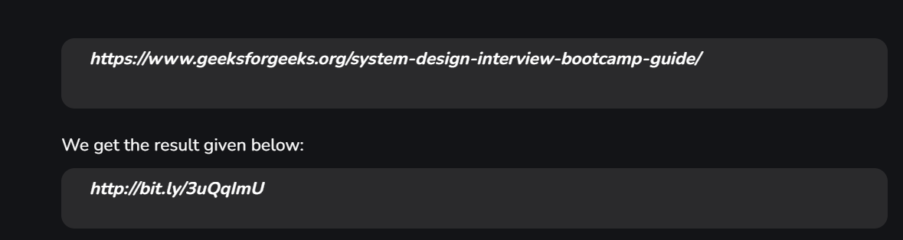

Requirements for URL Shortner Service System Design

Input and Output

1. Functional Requirements:
   Shorten URLs: Convert a long URL to a shorter URL.
   Redirect to the Original URL: Given a short URL, redirect to the original URL.
   URL Expiry: Allow users to set an expiry time for URLs.
   Analytics (Optional): Track click counts, geolocation, referrers, etc..

2. Non-Functional Requirements:
   High Availability: System should be always accessible.
   Low Latency: URL redirection should be quick.
   Scalability: Handle millions of requests per day.
   Durability: Ensure shortened URLs persist over time.

System Design
1. High-Level Architecture
   Frontend: UI for users to input and retrieve URLs.
   Backend: APIs for URL shortening and retrieval.
   Database: Store mappings between long URLs and short URLs.
   Cache: Speed up retrieval of frequently accessed URLs.
   Load Balancer: Distribute traffic across multiple servers.

2. Components
   API Gateway:
    Endpoints for URL shortening and retrieval.
    Example:
    POST /shorten: Shorten a URL.
    GET /{shortUrl}: Retrieve the original URL.
    URL Generation:
    Use a Base62 encoding (a mix of alphanumeric characters) for generating short URLs.
    Example: abc123 maps to https://short.ly/abc123.

Workflow
Shorten URL:

    User sends a POST request with a long URL.
    Server generates a unique ID (e.g., using a hash or incrementing counter).
    Map the short URL to the long URL in the database.
    Return the shortened URL.

Retrieve Original URL:

    User accesses the short URL.
    Server queries the database/cache.
    Redirect the user to the original URL