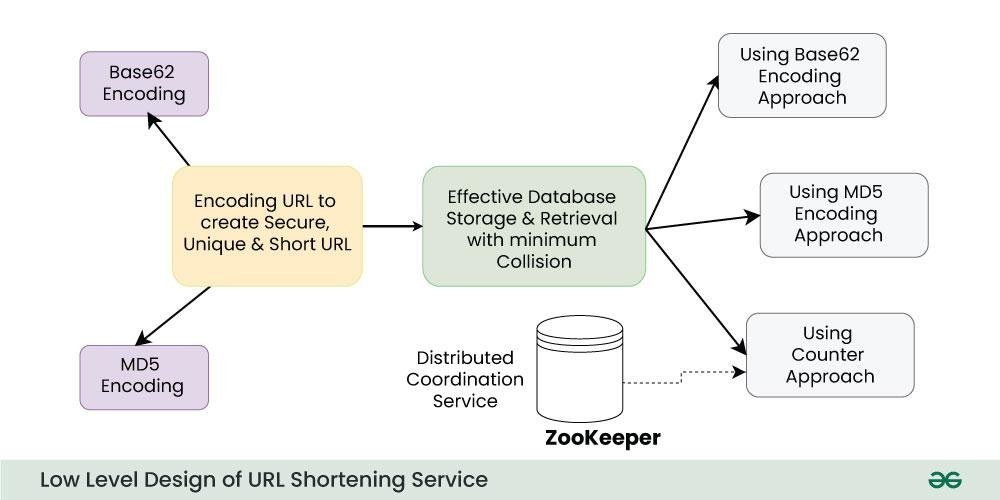
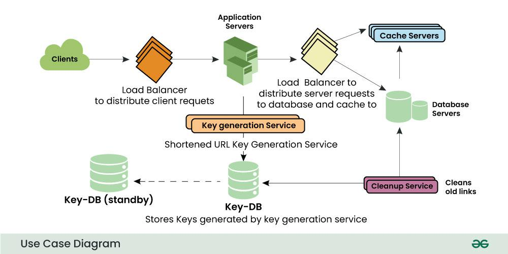

Requirements for URL Shortner Service System Design

Input and Output

1. Functional Requirements:
   Shorten URLs: Convert a long URL to a shorter URL.
   Redirect to the Original URL: Given a short URL, redirect to the original URL.
   URL Expiry: Allow users to set an expiry time for URLs.
   Analytics (Optional): Track click counts, geolocation, referrers, etc..

2. Non-Functional Requirements:
   High Availability: System should be always accessible.
   Low Latency: URL redirection should be quick.
   Scalability: Handle millions of requests per day.
   Durability: Ensure shortened URLs persist over time.

System Design
1. High-Level Architecture
   Frontend: UI for users to input and retrieve URLs.
   Backend: APIs for URL shortening and retrieval.
   Database: Store mappings between long URLs and short URLs.
   Cache: Speed up retrieval of frequently accessed URLs.
   Load Balancer: Distribute traffic across multiple servers.

2. Components
   API Gateway:
    Endpoints for URL shortening and retrieval.
    Example:
    POST /shorten: Shorten a URL.
    GET /{shortUrl}: Retrieve the original URL.
    URL Generation:
    Use a Base62 encoding (a mix of alphanumeric characters) for generating short URLs.
    Example: abc123 maps to https://short.ly/abc123.

Workflow
Shorten URL:

    User sends a POST request with a long URL.
    Server generates a unique ID (e.g., using a hash or incrementing counter).
    Map the short URL to the long URL in the database.
    Return the shortened URL.

Retrieve Original URL:

    User accesses the short URL.
    Server queries the database/cache.
    Redirect the user to the original URL

Low-Level Design for System Design of URL Shortner

URL Encoding Techniques to create Shortened URL
To convert a long URL into a unique short URL we can use some hashing techniques like Base62 or MD5. We will discuss both approaches.

1. Base62 Encoding
   Base62 encoder allows us to use the combination of characters and numbers which contains A-Z, a-z, 0–9 total( 26 + 26 + 10 = 62).
   So for 7 characters short URL, we can serve 62^7 ~= 3500 billion URLs which is quite enough in comparison to base10 (base10 only contains numbers 0-9 so you will get only 10M combinations).
   We can generate a random number for the given long URL and convert it to base62 and use the hash as a short URL id.
   If we use base62 making the assumption that the service is generating 1000 tiny URLs/sec then it will take 110 years to exhaust this 3500 billion combination.

2. MD5 Encoding
   MD5 also gives base62 output but the MD5 hash gives a lengthy output which is more than 7 characters.
    MD5 hash generates 128-bit long output so out of 128 bits we will take 43 bits to generate a tiny URL of 7 characters.
    MD5 can create a lot of collisions. For two or many different long URL inputs we may get the same unique id for a short URL and that could cause data corruption.
    So we need to perform some checks to ensure that this unique id doesn’t exist in the database already.

High-level Design of a URL-Shortening Service

User Interface/Clients:
The user interface allows users to enter a long URL and receive a shortened link. This could be a simple web form or a RESTful API.

Application Server:
The application server receives the long URL from the user interface and generates a unique, shorter alias or key for the URL. It then stores the alias and the original URL in a database. The application server also tracks click events on the shortened links.

Load Balancer:
To handle a large number of requests, we can use a load balancer to distribute incoming traffic across multiple instances of the application server. We can add a Load balancing layer at three places in our service:
Between Clients and Application servers
Between Application Servers and database servers
Between Application Servers and Cache servers

Database:
The database stores the alias or key and the original URL. The database should be scalable to handle a large number of URLs and clicks. We can use NoSQL databases such as MongoDB or Cassandra, which can handle large amounts of data and can scale horizontally.
As soon as a key is used, it should be marked in the database to ensure it doesn’t get used again. If there are multiple servers reading keys concurrently, we might get a scenario where two or more servers try to read the same key from the database

Caching:
Since reading from the database can be slow and resource-intensive, we can add a caching layer to speed up read operations. We can use in-memory caches like Redis or Memcached to store the most frequently accessed URLs.

Cleanup Service:
This service helps in cleaning the old data from the databases

Redirection:
When a user clicks on a shortened link, the application server looks up the original URL from the database using the alias or key. It then redirects the user to the original URL using HTTP 301 status code, which is a permanent redirect.

Analytics:
The application server should track click events on the shortened links and provide analytics to the user. This includes the number of clicks, the referrer, the browser, and the device used to access the link.

Security:
The service should be designed to prevent malicious users from generating short links to phishing or malware sites. It should also protect against DDoS attacks and brute force attacks. We can use firewalls, rate-limiting, and authentication mechanisms to ensure the security of the service.